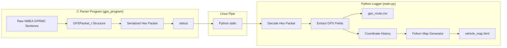

# Hướng dẫn Luồng Hoạt động (Codebase Flow) của Hệ thống GPS Telemetry

Dự án này là một mô phỏng thực tế của hệ thống nhúng giám sát hành trình (hộp đen ô tô). Hệ thống nhận dữ liệu GPS thô dạng chuỗi (NMEA GPRMC), phân tích bằng ngôn ngữ C để tối ưu hóa bộ nhớ, đóng gói nhị phân và truyền tải thời gian thực sang Python qua Pipe (luồng dẫn) để giải mã, ghi nhật ký CSV và vẽ bản đồ trực quan.

---

## 1. Sơ đồ Luồng Dữ liệu (Data Flow Diagram)

Dưới đây là sơ đồ mô tả cách dữ liệu dịch chuyển từ giả lập GPS đến lúc hiển thị trên bản đồ tương tác:



---

## 2. Giải thích Chi tiết Từng Thành phần

### A. Trạm Phát & Xử lý thô bằng C (`c_gps_parser/`)

Chương trình C đóng vai trò như firmware của thiết bị GPS phần cứng:
1. **Mock NMEA Database (`main.c`):** Chứa các chuỗi GPS tiêu chuẩn dạng `$GPRMC` giả lập xe đang di chuyển. Mỗi chu kỳ 1 giây sẽ lấy ra một chuỗi mới.
2. **Parser (`gps_parser.c` -> `parse_nmea_gprmc`):**
   * Tách các trường dữ liệu được phân chia bằng dấu phẩy `,`.
   * Trích xuất Giờ/Phút/Giây.
   * Chuyển đổi định dạng Vĩ độ (`DDMM.MMMM`) và Kinh độ (`DDDMM.MMMM`) sang **Độ thập phân (Decimal Degrees)** để vẽ bản đồ dễ dàng.
   * Nạp toàn bộ dữ liệu vào cấu trúc struct **`GPSPacket_t`** được tối ưu hóa đóng gói sát nhau (`#pragma pack(push, 1)`) để có kích thước cố định là **15 bytes** (3 bytes cho thời gian, 12 bytes cho 3 biến float lat/lon/speed).
3. **Serialization (`serialize_gps_packet`):**
   * Ép kiểu con trỏ struct sang `uint8_t*` để đọc 15 bytes bộ nhớ thô.
   * Chuyển đổi 15 bytes thô này thành một chuỗi **Hexadecimal dài 30 ký tự** (mỗi byte tương ứng với 2 ký tự Hex).
4. **Output Pipeline (`fflush`):**
   * Sử dụng lệnh `printf("%s\n", hex_output)` để in chuỗi Hex ra màn hình.
   * Gọi `fflush(stdout)` để đảm bảo luồng buffer được đẩy đi ngay lập tức thông qua Linux Pipe mà không bị lưu giữ lại trong hàng đợi RAM.

---

### B. Đường truyền Pipe (Inter-Process Communication)

Hai chương trình độc lập trao đổi dữ liệu với nhau bằng cơ chế **Standard Streams Pipeline** của hệ điều hành Linux:
```bash
./gps_program | python main.py
```
Dấu `|` (pipe) chuyển hướng toàn bộ dữ liệu đầu ra tiêu chuẩn (`stdout`) của chương trình C thành dữ liệu đầu vào tiêu chuẩn (`stdin`) của chương trình Python trong thời gian thực.

---

### C. Trạm Nhận, Lưu trữ & Vẽ bản đồ bằng Python (`python_logger/`)

Chương trình Python đóng vai trò như phần mềm máy chủ/ứng dụng giám sát:
1. **Đọc dữ liệu liên tục (`main.py`):**
   * Vòng lặp `for line in sys.stdin` liên tục lắng nghe dữ liệu từ pipe.
2. **Giải mã gói tin nhị phân (`decoder.py` -> `decode_hex_gps`):**
   * Kiểm tra tính hợp lệ của chuỗi Hex (phải đủ 30 ký tự).
   * Chuyển đổi ngược từ chuỗi Hex văn bản về mảng 15 bytes nhị phân thô (`bytes.fromhex()`).
   * Sử dụng thư viện `struct.unpack('<BBBfff', raw_bytes)` để giải nén nhị phân ngược lại đúng thứ tự cấu trúc C đã định dạng trước đó.
3. **Ghi nhật ký CSV:**
   * Cập nhật cuốn chiếu từng điểm tọa độ nhận được vào file [data/gps_route.csv](file:///run/media/hungdp/New%20Volume/Coding/gps_telemetry_project/data/gps_route.csv).
4. **Vẽ bản đồ di chuyển bằng Folium:**
   * Khi người dùng nhấn nút `Ctrl + C`, tiến trình đọc dữ liệu sẽ dừng lại (kích hoạt `KeyboardInterrupt`).
   * Khối lệnh `finally` sẽ kiểm tra mảng lịch sử tọa độ `coordinate_history`.
   * Sử dụng thư viện **`folium`** để dựng bản đồ vệ tinh dạng web tương tác:
     * Vẽ một đường nối liền màu đỏ (`PolyLine`) các điểm đã đi qua.
     * Cắm mốc màu xanh lá cây tại điểm xuất phát (`Start Route`).
     * Cắm mốc màu đỏ tại điểm kết thúc hành trình (`End Route`).
     * Xuất ra file [data/vehicle_map.html](file:///run/media/hungdp/New%20Volume/Coding/gps_telemetry_project/data/vehicle_map.html).

---

## 3. Cách Biên dịch và Vận hành Hệ thống

> [!NOTE]
> Hãy chắc chắn bạn đang đứng ở thư mục gốc của dự án (`gps_telemetry_project/`).

### Bước 1: Biên dịch chương trình C
Mở Terminal và chạy lệnh biên dịch bằng `gcc`:
```bash
gcc -o c_gps_parser/gps_program c_gps_parser/main.c c_gps_parser/gps_parser.c
```

### Bước 2: Cài đặt thư viện Python cần thiết
Cài đặt thư viện `folium` theo phiên bản đã cấu hình trong file `requirements.txt`:
```bash
pip install -r python_logger/requirements.txt
```

### Bước 3: Vận hành luồng liên hoàn (Pipe)
Chạy lệnh kết hợp để truyền dữ liệu thời gian thực từ C sang Python:
```bash
./c_gps_parser/gps_program | python python_logger/main.py
```
*Bạn sẽ thấy màn hình Terminal hiển thị liên tục thông tin tọa độ sau mỗi giây.*

### Bước 4: Dừng hệ thống & Kiểm tra kết quả
* Nhấn tổ hợp phím **`Ctrl + C`** để dừng chương trình.
* Hệ thống sẽ báo xuất file thành công. Bạn hãy mở file [data/vehicle_map.html](file:///run/media/hungdp/New%20Volume/Coding/gps_telemetry_project/data/vehicle_map.html) bằng trình duyệt web để chiêm ngưỡng bản đồ hành trình của xe!
