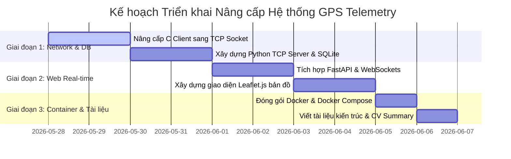

# Kế hoạch nâng cấp Dự án GPS Telemetry (CV-Ready Project)

Dự án hiện tại đang chạy rất tốt dưới dạng mô phỏng luồng dữ liệu cục bộ bằng Pipe (`stdout | stdin`). Để dự án này trở nên ấn tượng trên CV (đặc biệt cho các vị trí liên quan đến **Embedded/IoT Engineer**, **Backend/System Engineer** hoặc **Fullstack Engineer**), chúng ta cần nâng cấp kiến trúc của nó lên một hệ thống phân tán thực tế.

---

## Các Module Nâng cấp Đề xuất

### 1. TCP/IP Socket Network Communication (IoT Simulation)
Thay thế Pipe cục bộ `|` bằng kết nối mạng Socket.
* **C Client (Hộp đen GPS):** Đóng vai trò là IoT Device gửi dữ liệu qua TCP/UDP Socket tới một IP/Port cụ thể (giả lập thiết bị gửi dữ liệu qua 4G/Wifi về Server).
* **Python Server (IoT Gateway):** Đóng vai trò Server lắng nghe kết nối từ các thiết bị phần cứng, giải mã dữ liệu nhị phân và điều phối.

### 2. Lưu trữ Dữ liệu với Cơ sở Dữ liệu (SQLite & SQL)
Thay thế file CSV tĩnh bằng cơ sở dữ liệu quan hệ SQLite để quản lý dữ liệu lịch sử tối ưu hơn.
* Thiết kế bảng `gps_logs` (id, time_utc, latitude, longitude, speed_kmh, received_at).
* Lưu trữ lịch sử hành trình lâu dài, hỗ trợ truy vấn các chuyến đi dễ dàng.

### 3. Web Dashboard Real-time (FastAPI + WebSockets + Leaflet.js)
Xây dựng một giao diện Web Dashboard hiển thị hành trình của xe chạy trong thời gian thực cực kỳ mượt mà.
* **Backend:** FastAPI (Python) quản lý các kết nối WebSocket từ trình duyệt và đẩy dữ liệu GPS nhận được từ Socket xuống Client.
* **Frontend:** Trang HTML/JS sử dụng thư viện bản đồ mã nguồn mở **Leaflet.js** (thay thế Folium tĩnh) để vẽ hành trình chuyển động của xe trực tiếp trên trình duyệt mà không cần tải lại trang.

### 4. Dockerization (Docker & Docker Compose)
Đóng gói toàn bộ hệ thống vào các container độc lập.
* **Dockerfile** cho ứng dụng C.
* **Dockerfile** cho ứng dụng Python.
* **docker-compose.yml** để chạy toàn bộ hệ thống (Server, Database, Dashboard, Client) chỉ bằng một lệnh duy nhất: `docker-compose up`.

---

## Đề xuất Thay đổi Cấu trúc Thư mục

```text
gps_telemetry_project/
├── c_gps_client/             # Đổi tên từ c_gps_parser, đóng vai trò IoT Client
│   ├── gps_parser.c
│   ├── gps_parser.h
│   ├── main.c                # Cập nhật để gửi dữ liệu qua Socket thay vì printf
│   └── Dockerfile            # Multi-stage build cho ứng dụng C
├── python_server/            # Đổi tên từ python_logger, đóng vai trò Backend Gateway
│   ├── app/
│   │   ├── __init__.py
│   │   ├── main.py           # FastAPI + WebSocket server
│   │   ├── decoder.py        # Giải mã binary struct
│   │   ├── database.py       # Kết nối SQLite & lưu dữ liệu
│   │   └── templates/        # Giao diện web Leaflet.js
│   │       └── index.html
│   ├── requirements.txt      # Thêm fastapi, uvicorn, websockets
│   └── Dockerfile            # Dockerfile cho Python Server
├── data/
│   └── telemetry.db          # Database SQLite thay cho file CSV
├── docker-compose.yml        # Điều phối khởi chạy toàn hệ thống
└── README.md                 # Tài liệu hướng dẫn kiến trúc mới
```

---

## Kế hoạch Thực hiện Từng bước (Milestones)



---

## Các Lựa chọn Triển khai

Bạn có thể lựa chọn triển khai từng bước theo hướng sau:
1. **Phương án A (Tập trung System/IoT):** Làm phần Kết nối Socket TCP (C sang Python) và Cơ sở dữ liệu SQLite trước để hoàn thiện cốt lõi hệ thống.
2. **Phương án B (Tập trung Fullstack/Web):** Triển khai giao diện Web Dashboard thời gian thực trước (sử dụng luồng dữ liệu hiện tại để đưa lên giao diện web qua WebSockets).
3. **Phương án C (Triển khai toàn bộ lần lượt):** Thực hiện lần lượt từ Giai đoạn 1 đến Giai đoạn 3 theo sơ đồ trên.
